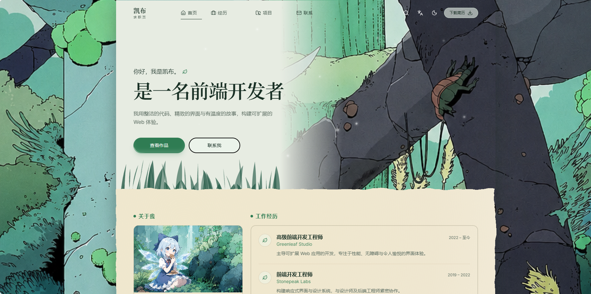

# Kayb · 前端开发者求职页

一个以「森林 / 残垣」为主题的个人求职简历单页应用,采用做旧羊皮纸质感与撕边纸张效果,支持中英双语与明暗主题切换。基于 **React 19 + TypeScript + Vite + Tailwind CSS v4** 构建。

> 灵感来源于 Scavengers 风格的森林意象:雾色嫩绿画布、深林绿主色、漂浮的种子与重新生长、占领接缝的杂草。

## 📸 预览

<p align="center">
  
</p>

## ✨ 功能特性

- 🌲 **森林主题设计** — 雾绿背景 + 做旧羊皮纸内容区,撕边纸张滤镜营造手工质感
- 🌗 **明暗双主题** — 基于 View Transitions API 的「圆形扩散」切换动画,刷新前无闪烁(在 `index.html` 中提前应用主题)
- 🌏 **中英双语 i18n** — 基于 i18next,自动检测浏览器语言并持久化;`<title>` 等也随语言切换
- 🎬 **细腻动效** — 使用 Motion(原 Framer Motion)实现入场淡入、滚动揭示、漂浮种子、闪光按钮、边框流光等
- 🔍 **命令面板搜索** — 基于 cmdk 的快捷搜索,可快速跳转板块与项目
- 📱 **响应式布局** — 桌面端双栏卡片网格,移动端单栏自适应
- ♿ **可访问性友好** — 语义化标签、`aria-*` 属性,并尊重 `prefers-reduced-motion`
- 📋 **一键复制联系方式** — QQ / 微信 等支持点击复制,配合 sonner 轻提示

## 🧩 页面板块

- **Hero 首页** — 问候语、标题、简介与行动按钮(查看作品 / 联系我)
- **关于我 / 技能 / 教育** — 左栏卡片(头像、分类技能标签、教育经历)
- **工作经历 / 精选项目 / 箴言 / 联系方式** — 右栏卡片(含公司 Logo、项目封面、可复制联系方式)
- **页头 / 页脚** — 粘性导航(随滚动收起/展开)、语言切换、主题切换、简历下载

## 🛠 技术栈

| 分类    | 技术                                                                                   |
| ------- | -------------------------------------------------------------------------------------- |
| 框架    | React 19、TypeScript                                                                   |
| 构建    | Vite 8、`@vitejs/plugin-react`                                                         |
| 样式    | Tailwind CSS v4、`tw-animate-css`                                                      |
| 动效    | Motion                                                                                 |
| 国际化  | i18next、react-i18next                                                                 |
| UI 基建 | Radix UI(Avatar / Dialog / Slot)、cmdk、class-variance-authority、tailwind-merge、clsx |
| 图标    | lucide-react                                                                           |
| 提示    | sonner                                                                                 |

## 🎨 设计系统

设计令牌集中定义于 [`src/index.css`](src/index.css),采用 **OKLCH** 色彩空间,通过 CSS 变量在 `:root` 与 `.dark` 间切换。

### 主题色板(浅色)

| 令牌                   | 值                                             | 用途         |
| ---------------------- | ---------------------------------------------- | ------------ |
| `--background`         | `oklch(0.97 0.018 155)`                        | 雾色嫩绿画布 |
| `--foreground`         | `oklch(0.28 0.04 165)`                         | 主文字       |
| `--primary`            | `oklch(0.52 0.11 160)`                         | 深林绿主色   |
| `--card`               | `oklch(0.99 0.008 150)`                        | 卡片底       |
| `--muted` / `--accent` | `oklch(0.94 0.02 158)` / `oklch(0.9 0.06 152)` | 弱化 / 强调  |
| `--radius`             | `0.75rem`                                      | 全局圆角基准 |

> 暗色模式下整体压暗并偏暖,羊皮纸转为暖调深绿棕;`--hero-panel`、`--frame` 等专用令牌分别控制 Hero 文案面板与卡片边框墨线。

### 字体

- **正文(`--font-sans`)**:`Inter`
- **标题(`--font-display`)**:`Fraunces`(衬线,带视觉尺寸轴)

字体通过 Google Fonts 在 [`index.html`](index.html) 中预连接并加载。

### 特色质感

- `.parchment` — 做旧羊皮纸:暖奶油色渐变 + SVG 噪声纤维纹理
- `.parchment-torn` — 撕边滤镜(仅桌面端 ≥1024px 启用,移动端关闭以避免抖动)
- `.parchment-panel` — 仅墨线边框、无填充的卡片框
- 自定义细滚动条(主题嫩绿色)

## 📁 项目结构

```
src/
├─ App.tsx                      # 根组件:森林背景、页头、主内容
├─ main.tsx                     # 入口(挂载 i18n、dev 下挂载 react-grab)
├─ index.css                    # 设计令牌、主题、羊皮纸/滚动条等工具类
├─ features/
│  ├─ home/                     # 首页业务模块
│  │  ├─ home-page.tsx
│  │  └─ components/            # hero / about / skills / education /
│  │                            # experience / projects / quote / contact 等卡片
│  └─ search/site-search.tsx    # 命令面板搜索
└─ shared/                      # 跨模块共享
   ├─ components/
   │  ├─ layout/                # 页头、页脚、导航、语言/主题切换
   │  ├─ magicui/               # border-beam、floating-seeds、shimmer-button
   │  ├─ ui/                    # avatar / badge / button / card / command 等基础组件
   │  └─ ...                    # responsive-image、reveal、torn-filter 等
   ├─ config/                   # site.ts(站点元信息)、skills.ts(技能清单)
   ├─ i18n/                     # 语言检测、资源、类型与 useContent Hook
   └─ lib/                      # use-theme、utils(cn 等)
```

> 路径别名:`@/` 指向 `src/`。

## 🚀 快速开始

> 需要 Node.js 与 pnpm(也可使用 npm / yarn)。

```bash
# 安装依赖
pnpm install

# 启动开发服务器(默认 http://localhost:5173)
pnpm dev

# 生产构建(先做类型检查 tsc -b 再 vite build)
pnpm build

# 本地预览构建产物
pnpm preview

# 代码检查
pnpm lint
```

## ⚙️ 自定义配置

### 站点信息

编辑 [`src/shared/config/site.ts`](src/shared/config/site.ts) 修改姓名、邮箱、社交链接、联系方式、简历地址(`/resume.pdf`)与图片资源。

### 文案与多语言

中英文案分别位于 [`src/shared/i18n/locales/zh.ts`](src/shared/i18n/locales/zh.ts) 与 [`src/shared/i18n/locales/en.ts`](src/shared/i18n/locales/en.ts),两者均实现 [`types.ts`](src/shared/i18n/types.ts) 中的 `Content` 类型,新增字段会获得类型校验。组件内通过 `useContent()` 读取当前语言的内容树。

### 技能清单

编辑 [`src/shared/config/skills.ts`](src/shared/config/skills.ts) 调整分类与技能项(含官方文档链接)。

### 主题配色

在 [`src/index.css`](src/index.css) 中修改 `:root` / `.dark` 下的 OKLCH 令牌即可整体换肤。

### 静态资源

头像、项目封面、森林背景、`resume.pdf` 等放置于 `public/` 目录,路径在 `site.ts` 与 i18n 文案中引用。

## 📄 许可证

仅供个人作品集用途。如需复用,请替换其中的个人信息与素材。
